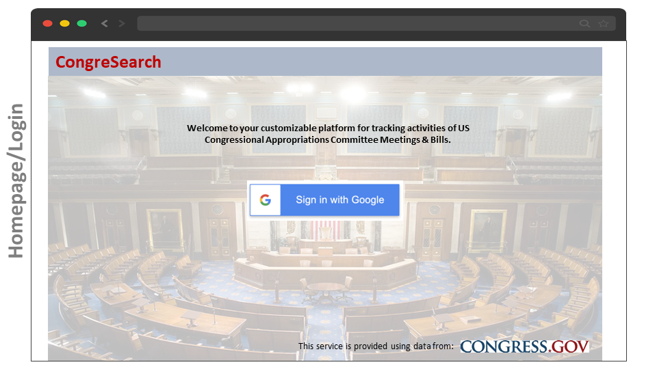
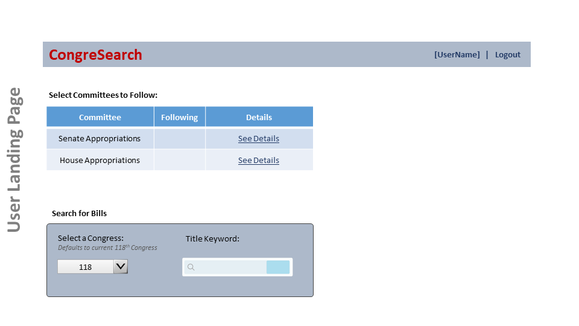

  
   
# CongreSearch

CongreSearch empowers you to flexibly and efficiently track activities in the United States Federal Congress. Taking advantage of the [congress.gov API](https://github.com/LibraryOfCongress/api.congress.gov/), this platform will keep you up-to-date on bills and committee meetings (further features still to come). Become a DC in-the-know insider before you know it! 

## MVP Goals/Features/User Stories

* AUTHENTICATION: 
  * User can secure log in using Google OAuth.
  * All create/update/delete interactions between the user and database models will be secured using middleware.
  * Systems shall create a basic User Profile for each user, including: username/email (from Google), currently followed committees, and currently followed bills.
* CONGRESSIONAL COMMITTEE MEETINGS: 
  * Select from a shortlist of congressional committees (House/Senate Appropriations) to 'follow' 
    * User will be able to make updates (add/remove) to their list of followed committees
  * For each followed committee, users will be able to: 
    * View all future meetings as soon as they are scheduled (and the user logs in)
    * See a link to each meeting's page on congress.gov (which includes meeting chamber, type, title, related committees, date, and links to hearing transcripts, documents, and videos when available) 
* BILLS: 
  * Input a congress number (defaults to current congress, 118), bill type, and search keyword to see a list of bills from that congress, of that type, and whose titles contain the keyword. 
    * List will include a link to the bill's page on congress.gov where the user can find bill details.
  * User will be able to select bills to 'follow' 
    * User will be able to make updates (add/remove) to their list of followed bills
    * Receive notifications when the bill text becomes available.

## Stretch Goals/Features/User Stories

* USER INTERFACE (UI)
  * Implement an expanding table to show meeting/bill details within the app. Extra stretch: show meeting transcripts and bill text natively within the app.
* FEATURES
  * Implement Advanced Search interface for bills, permitting:
    * Boolean chains of multiple keywords in the title
    * Searching for keywords in the bill text
  * Display further bill details such as sponsors, tables of actions and/or amendments
  * Include links/text of committee reports
  * User can configure email notifications when there are certain types of changes to a 'followed' item, i.e.:
    * A new committee meeting is scheduled
    * Bill text becomes available
    * Bill amendments are added
  * See a native-to-app user-friendly view of single bill's details, including policy area, title, and associated committees; include a link to the text when available. 
  * Add an avatar picture and list of previous/current 'followed' bills to the User Profile

## ERD

## RESTful Routing

| HTTP Method | URL                                            | CRUD   | Response                | Notes                                                                          |
| ----------- | ---------------------------------------------- | ------ | ----------------------- | ------------------------------------------------------------------------------ |
| GET         | /                                              | INDEX  |                         | Login/landing page                                                             |
| GET         | /users/:user_id                                | SHOW   | { user }                | User homepage                                                                  |
| POST        | /users                                         | CREATE | { user }                | Create new user                                                                |
| DELETE      | /users/:user_id                                | DELETE |                         | Delete user                                                                    |
| GET         | /committee-meeting                             | INDEX  |                         | Display committee meetings from :congress associated with followedCommittee(s) |
| GET         | /committee-meeting/:congress/:chamber/:eventID | SHOW   | { committee-meeting }   | Display committee meeting details                                              |
| GET         | /bill/:congress/:type                          | INDEX  | [{ bill }, {bill}, ...] | Get list of bills from :congress containing titleKeyword                       |
| GET         | /bill/:congress/:type/:billNumber              | SHOW   | { bill }                | Display bill details                                                           |

## Wireframes
 

 
 

